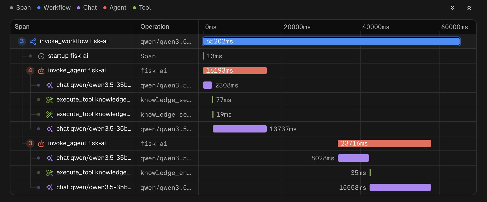

# Telemetry

Fisk AI exports OpenTelemetry traces and metrics over OTLP/HTTP, following the GenAI semantic conventions. One run is
one trace: how long it took, which model calls it made, which tools it ran, and where the tokens went. It applies to
`fisk run`, to the runs `fisk serve` hosts, and to knowledge searches served by `fisk mcp`. The a2a surface, which
serves tools to other agents without running the loop, exports a span per served call and joins the caller's trace.

> [!info] Note
> Traces and metrics go only to the collector configured below. The Fisk project receives
> nothing, and export is off by default. Prompts and tool results are not exported unless
> [content capture](#content-capture) is turned on.

A single session with two prompts:



## Turning it on

Add a `telemetry` block and point it at a collector:

```yaml
telemetry:
  enabled: true
  endpoint: http://127.0.0.1:4318
```

This build speaks OTLP/HTTP, port `4318`. Pointing it at `4317` is the OTLP/gRPC port and is rejected at startup.

Every setting is in the [reference](../reference/#telemetry). Transport credentials are never in the file: the
standard `OTEL_EXPORTER_OTLP_HEADERS` and friends configure the connection, so the same configuration sends to a
collector, Grafana Tempo, Honeycomb or any OTLP/HTTP endpoint.

`--no-telemetry` suppresses export: for one run on `fisk-ai run`, and for the whole process on `fisk-ai serve`,
which reports whether telemetry is on in its startup banner.

## A local collector

Save as `otelcol.yaml` and run `otelcol-contrib --config otelcol.yaml`:

```yaml
receivers:
  otlp:
    protocols:
      http:
        endpoint: 127.0.0.1:4318

exporters:
  debug:
    verbosity: detailed

service:
  pipelines:
    traces:
      receivers: [otlp]
      exporters: [debug]
    metrics:
      receivers: [otlp]
      exporters: [debug]
```

Then run the agent. The run's summary line ends with the trace id, and the full-screen UI shows it on the end card:

```nohighlight
Run summary: model=claude-sonnet-5 llm_calls=2 tool_calls=1 tokens=1832/241 thinking=0 latency=4.1s trace=4bf92f3577b34da6a3ce929d0e0e4736
```

With `--verbose` the run also reports what reached the collector. An export that did not arrive is always reported.

## What a trace looks like

A one-shot run:

```nohighlight
invoke_agent <identity>            the whole run
├── startup <identity>             loading tools, opening stores, importing remote tools
│   └── memory_index               the start-of-run memory listing
├── chat <model>                   one model call, one event per HTTP attempt
├── execute_tool <name>            one tool call
│   ├── retrieval                  a knowledge_search
│   │   └── embeddings <model>     one request to the embeddings server
│   └── invoke_agent <remote>      a tool served by another agent
└── chat <model>
```

`retrieval` covers `knowledge_search`. `knowledge_enumerate` gets its own span of that name, since it never ranks and
never uses vectors.

An interactive `--chat` run wraps the same work in a workflow, one agent invocation per turn:

```nohighlight
invoke_workflow <identity>
├── startup <identity>
├── invoke_agent <identity>        turn 1
│   ├── chat <model>
│   └── execute_tool <name>
└── invoke_agent <identity>        turn 2
    └── chat <model>
```

A resumed session is a new trace, not a continuation. A trace spans two processes only across an a2a call, where the
request carries the caller's trace context. Group by `gen_ai.conversation.id`
to see a session's whole history. A resumed run's first `chat` span continues the iteration numbering, so
`fisk.llm.iteration` starting at 17 is expected.

## Attributes

Standard `gen_ai.*` attributes carry the model, the token usage, the tool names and the stop reasons. Fisk-specific
ones use a `fisk.` prefix.

| Attribute | Where | Meaning |
|---|---|---|
| `fisk.run.terminal_reason` | root, turn | `completed`, `max_iterations`, `error`, `budget`, `suspended`, `setup_failed` |
| `fisk.run.resumed`, `.crashed`, `.interactive` | root | how the run started and ended |
| `fisk.run.tool_calls`, `.remote_tool_calls` | root | this run's tool calls |
| `fisk.llm.uncached_input_tokens` | root, turn, chat | input tokens billed at the uncached rate |
| `fisk.llm.thinking`, `.prompt_cache`, `.tool_search` | root | the feature switches this run used |
| `fisk.llm.iteration`, `.messages`, `.tools` | chat | loop index and the sizes sent |
| `fisk.session.end_id` | root | the session the run ended on, when `/clear` rotated it |
| `fisk.session.usage.*`, `.llm_calls` | root | session totals including the resumed prefix, resumed runs only |
| `fisk.turn.index` | turn | one-based turn number |
| `fisk.tool.kind` | execute_tool | which provider supplied the tool |
| `fisk.tool.outcome` | execute_tool | `executed`, `error`, `unknown_tool`, `policy_denied`, `missing_arguments`, `confirm_denied` |
| `fisk.tool.arg_keys` | execute_tool | the argument key names, never their values |
| `fisk.tool.requested_name` | execute_tool | the name the model asked for, unknown tools only |
| `fisk.tool.confirm_wait_ms` | execute_tool | how long the call waited on the operator |
| `fisk.tool.remote`, `.remote_agent`, `.rewritten`, `.resumed` | execute_tool | how the call was dispatched |
| `fisk.tool.exit_code` | execute_tool | the exit status of the command the tool ran, absent when it ran none |
| `fisk.tools.application`, `.builtin`, `.remote`, `.custom`, `.deferred` | startup | the resolved tool inventory |
| `fisk.remote_hosts` | startup | configured remote tool hosts |
| `fisk.memory.backend`, `.location` | startup, memory_index, execute_tool | the memory store this run bound |
| `fisk.memory.entries` | memory_index | memories the start-of-run listing returned, absent when it failed |
| `fisk.knowledge.tier.configured` | retrieval | `hybrid` or `lexical`, as configured |
| `fisk.knowledge.tier.effective` | retrieval | the tier that ran, absent when neither retriever did |
| `fisk.knowledge.top_k` | retrieval | the effective result ceiling, after defaulting and clamping |
| `fisk.knowledge.search.status` | retrieval | `ok`, `index_not_built`, `index_empty` |
| `fisk.knowledge.sections` | retrieval | sections returned |
| `fisk.knowledge.indexed_chunks` | retrieval | corpus size, absent when there is no index |
| `fisk.knowledge.degraded`, `.degraded_reason` | retrieval | the fallback to lexical and why |
| `fisk.knowledge.enumerate.status` | knowledge_enumerate | `ok`, `index_not_built`, `corpus_empty`, `query_empty` |
| `fisk.knowledge.matched`, `.documents`, `.truncated` | knowledge_enumerate | the matched set, what was returned, and whether they differ |
| `fisk.knowledge.limit`, `.min_body_matches` | knowledge_enumerate | the options that shaped those counts |
| `fisk.knowledge.indexed_documents` | knowledge_enumerate | corpus size, absent when there is no index |
| `fisk.embeddings.inputs` | embeddings | texts in this request |
| `fisk.embeddings.purpose` | embeddings | `query` or `dimension_probe` |

Group tool calls by `fisk.tool.outcome`: a policy denial, an unknown tool and a failed command all return an error to
the model, and only this tells them apart.

A run with [content capture](#content-capture) on carries the `gen_ai.*` content attributes and `fisk.content.*`
alongside these.

On `execute_tool`, `fisk.memory.backend` and `.location` are present on memory tool calls only, so filtering on them
selects the calls that reached the store. They describe the tool that ran, which a `PreToolUse` hook can change, and
they are span attributes rather than metric labels: on the tool duration histogram the backend would be empty for
every tool that is not a memory tool. They stay on `startup` as well, which is where a run that binds a store but
never calls a memory tool reports it.

### Model call attempts

One `chat` span can be several HTTP requests: the Anthropic SDK retries a rate limit or a transport failure inside the
call. The span covers the whole call, and each attempt is recorded as an event on it.

| Event | When |
|---|---|
| `fisk.llm.http_response` | an attempt got a response, whatever the status |
| `fisk.llm.http_error` | an attempt got no response at all |

| Attribute | Where | Meaning |
|---|---|---|
| `fisk.llm.http_attempt` | both events | one-based attempt number within this model call |
| `fisk.llm.http_duration_ms` | both events | how long the attempt took |
| `http.response.status_code` | `fisk.llm.http_response` | the status the attempt received |
| `error.type` | `fisk.llm.http_error` | the failure class, `provider` unless the run was canceled or timed out |
| `http.request.resend_count` | the `chat` span | retries after the first attempt, absent when there were none |

A call that took ten seconds with `http.request.resend_count` of 3 spent most of it waiting on retries, not on the
model. The status code is on the events rather than the span because a span attribute would be last-attempt-wins and
report `200` for a call that spent most of its time being rate limited.

Nothing about the request or the response body is recorded: not the URL, which can carry credentials in its userinfo,
not the headers, and not the response body or the error text. An attempt is a status code, a duration and an ordinal.

### Remote agents

A tool served by another agent gets an `invoke_agent <remote>` span inside the `execute_tool` span that dispatched it.
It covers the a2a call.

| Attribute | Meaning |
|---|---|
| `gen_ai.operation.name` | `invoke_agent` |
| `fisk.tool.remote_agent` | the agent the call was sent to |
| `gen_ai.tool.name` | the tool named on the wire |
| `error.type` | how the call ended, absent on success |

`error.type` separates the failures that look alike from the model's side:

| Value | Meaning |
|---|---|
| `remote_unavailable` | no agent answered, or the deadline passed first |
| `tool_error` | the call was answered and the tool failed on the far side |
| `canceled`, `timeout` | this run stopped, not the peer |
| `other` | anything else |

The request carries this span's trace context, so a peer running Fisk AI puts its own span for the call in this trace
and a slow remote call shows where the time went. A peer that exports nothing, or one that is not Fisk AI, still shows
only as a slow span here.

The two sides can disagree about when the call ended. The callee bounds a served call with its own
`expose.agent.a2a.tool_timeout` and the caller waits `llm.budget.call_timeout`, so a trace can show the server's span
still open after the caller's closed as `remote_unavailable`.

### Knowledge

`fisk.knowledge.tier.configured` and `.tier.effective` differing means the vector tier was configured and did not run.
`fisk.knowledge.degraded_reason` says why, from a fixed set: `embeddings` and `timeout` are the embeddings server,
`index_meta` is the index's own metadata failing to read, `canceled` is the run stopping. Only `index_meta` is a
problem with the store rather than the server, and it is the one case that opens no `embeddings` child span.

`fisk.knowledge.sections` counts sections and `fisk.knowledge.documents` counts documents; several sections routinely
come from one file, so the two are not comparable.

The `embeddings` span carries `server.address`, `server.port` and, when a response arrived,
`http.response.status_code`. The dimension probe is lazy and cached per process, so the first search of a run makes two
embeddings requests; `fisk.embeddings.purpose` tells them apart. A server that cannot be reached never lets the probe
cache, so every later search makes a probe request and no query request.

`retrieval` and `embeddings` do not add up to the `execute_tool` span above them: the tool renders its tier banner and
trims results to the injection budget after the store has returned.

Indexing is not instrumented. `fisk knowledge index` and `fisk knowledge watch` start no telemetry, so the knowledge
spans are constructed and discarded there.

`fisk mcp` does export them. A `knowledge_search` that arrived over MCP opens the same `retrieval` and `embeddings`
spans an agent run does, and each is its own trace with `retrieval` at the root: there is no run above it. Everything
else `fisk mcp` serves is uninstrumented, so a config that exposes no knowledge tools exports nothing.

## Metrics

| Metric | Attributes |
|---|---|
| `gen_ai.client.token.usage` | operation, provider, model, `gen_ai.token.type` |
| `gen_ai.client.operation.duration` | operation, provider, model, `error.type` |
| `gen_ai.invoke_agent.duration` | agent name, terminal reason, interactive |
| `gen_ai.invoke_agent.inference_calls` | as above |
| `gen_ai.invoke_agent.tool_calls` | as above |
| `gen_ai.execute_tool.duration` | tool name, kind, outcome, `error.type` |
| `fisk.knowledge.degraded_searches` | `fisk.knowledge.degraded_reason` |
| `fisk.session.append.duration` | `fisk.session.backend`, `error.type` |

`gen_ai.invoke_agent.*` is recorded per turn, treating a one-shot run as one turn.

`fisk.session.append.duration` times each write to the run journal, and is recorded only for a checkpointed run. It is
a metric rather than a span because a run appends once per record, so a span each would outnumber every other span in
the trace. The `file` backend writes locally and sits in the lowest buckets; the `jetstream` backend makes a network
round trip per append, and this metric shows that difference. A failed append is recorded with its `error.type`, so the
time spent before a failure is visible rather than missing.

`fisk.knowledge.degraded_searches` counts searches that fell back to lexical. It is a metric rather than a span
attribute alone because spans are sampled: with `sample_ratio` below 1.0 most degraded searches never reach the
backend, and an embeddings outage silently costs every search its vector tier. There is no knowledge duration metric;
`gen_ai.execute_tool.duration` filtered on `gen_ai.tool.name` covers it.

`gen_ai.token.type` carries only `input` and `output`, so the histogram can be summed without grouping. Set
`no_metrics: true` to export traces alone.

## Working out cost

`gen_ai.usage.input_tokens` includes cached tokens, and cache reads bill at roughly a tenth of the uncached rate. So:

```nohighlight
cost = (input_tokens - cache_read - cache_creation) x uncached rate
     + cache_read                                  x cache read rate
     + cache_creation                              x cache write rate
     + output_tokens                               x output rate
```

`fisk.llm.uncached_input_tokens` is that first term already worked out, and is the same number the run summary prints.

`gen_ai.usage.reasoning.output_tokens` is the share of `output_tokens` the model spent reasoning. It is already
included in `output_tokens`, so it does not enter the calculation above; it is there because reasoning is not
displayed by default, which makes a dashboard the only place its cost is visible.

On a resumed run, `gen_ai.usage.*` on the root covers that process alone, so summing it across a session's traces
gives the session total once. `fisk.session.usage.*` carries the cumulative view for comparison.

## Privacy

By default spans carry structure and timing: no prompt, tool argument value or tool result is exported, and error
messages are reduced to a fixed `error.type` class rather than their text.

[Content capture](#content-capture) changes that. With it on, the system prompt, the conversation, the model's
replies, tool arguments and tool results are exported as span attributes. It is off unless the config turns it on.

The OpenTelemetry credential variables are stripped from tool subprocess environments whether or not telemetry is
enabled, so `--no-telemetry` does not re-expose a collector token. See the reference
[Safety](../reference/#safety) section for the full list and its limits.

## Content capture

Off by default. With it on, a trace carries the conversation itself:

```yaml
telemetry:
  enabled: true
  endpoint: https://otel.example.net:4318
  capture:
    enabled: true
    messages: delta     # delta | full
    max_bytes: 8192     # per attribute
```

> [!warning] Everything the model saw is exported
> Whoever can read the traces can read the conversation, and an export cannot be recalled. Tool results are the
> verbatim output of whatever command the model ran, and the system prompt includes the memory index. Nothing is
> redacted: content capture bypasses the `error.type` reduction and every other limit described above. Use it for a
> bounded investigation against a collector you control, not as a fleet default.

A run with capture on shows `OTEL Enabled + content` on the full-screen startup card and marks its summary line:

```nohighlight
Run summary: model=claude-sonnet-5 llm_calls=2 tool_calls=1 tokens=1832/241 thinking=0 latency=4.1s trace=4bf92f35 content=exported
```

`fisk info` shows what would be captured, including the derived export batch size. Plain `http://` to a non-loopback
host is rejected at startup while capture is on.

There is no command-line flag: capture is a config setting. `--no-telemetry` suppresses it along with the rest of the
export.

### The content attributes

| Attribute | Where |
|---|---|
| `gen_ai.system_instructions` | startup, once per run |
| `gen_ai.input.messages` | chat |
| `gen_ai.output.messages` | chat |
| `gen_ai.tool.call.arguments` | execute_tool |
| `gen_ai.tool.call.result` | execute_tool |
| `fisk.content.from_index` | chat, where this call's messages start |
| `fisk.content.truncated` | the attributes on this span that were cut |
| `fisk.content.dropped_messages` | messages dropped to fit |

Each is a JSON document in the shape the GenAI conventions define.

Never exported: a thinking block's provider signature, and the payload of a provider-specific block such as a
server-side tool search result. Reasoning text is exported.

A denied tool call still exports its arguments. The system prompt is on `startup` rather than on each model call
because it does not change during a run.

### Why `gen_ai.input.messages` holds only one message

`messages: delta`, the default, exports only what each model call added to the conversation, so no single span holds
the whole thing. `fisk.content.from_index` says where a span's messages start; add it to the number of messages
exported and you get `fisk.llm.messages` on the same span. Consecutive model calls chain, so a gap means a span did
not arrive.

Set `capture.messages: full` to put the whole conversation on every model call. That is quadratic in the length of
the conversation: a thirty-iteration run exports thirty copies of a growing transcript.

Some content reaches no message attribute at all. A run that ends at the iteration cap, on the token budget, or on a
hook abort leaves its last tool results with no model call after them; those survive as `gen_ai.tool.call.result` on
the tool spans. Do not sum message attributes across the traces of one session either: a resumed run's first model
call carries the whole restored conversation.

### Sizing

Each attribute is capped at `capture.max_bytes` (256 to 65536, default 8192), measured on the encoded JSON. Over the
cap, whole messages are dropped oldest-first and then text is shortened, so the document always parses;
`fisk.content.truncated` and `fisk.content.dropped_messages` say what happened.

`OTEL_SPAN_ATTRIBUTE_VALUE_LENGTH_LIMIT` lowers the cap to match rather than being overridden, so the SDK never cuts
a document mid-structure.

Capture raises the size of every export, so the batch size is reduced and gzip is turned on. A collector may still
need its receive limit raised:

```yaml
receivers:
  otlp:
    protocols:
      http:
        endpoint: 127.0.0.1:4318
        # Raise when content capture is on and exports are refused.
        max_request_body_size: 8388608
```

With `sample_ratio` below 1.0, content is exported only for sampled traces.

### When it does not look right

| What you see | What it means |
|---|---|
| a value ends in `[truncated by fisk-ai: ...]` | it hit `capture.max_bytes`; the marker names the original size |
| a value is cut off and the span has no `fisk.content.truncated` | your collector or backend cut it, not Fisk AI |
| `gen_ai.input.messages` holds one message | the delta; see above |
| no traces, and an export warning after the run | the batch was refused, usually on size with capture on |
| spans missing from a trace, and no warning at all | the span queue overflowed; the delivery line cannot see this |

## The other run outputs

| Output | Scope | Contents | Use when |
|---|---|---|---|
| `--trace FILE` | one run, local | exact request and response bodies, including retries | debugging Fisk AI or the provider |
| `--http-debug` | one run, local | raw bodies to a fixed file, a subset of `--trace` | prefer `--trace` |
| run summary | one run, local | counters and latency | the receipt for the run that just finished |
| telemetry | many runs, many processes | structure and timing; the conversation only with `capture` on | which tool fails, where time goes, across a fleet |
